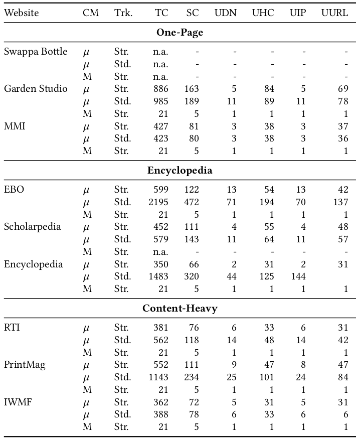

# Experiment 01

This folder contains the graphameleon-ds documents in relation to the *Website complexity clustering* experiment.

## Workbench settings

Here is a summary of the settings for the experiment:

* Graphameleon 2.1.0
  - Collect mode: see the "Data capture" Section below.
    - Micro
    - Macro
  - General output format: Semantize, with "v2" mapping definitions as provided in the [Graphameleon](https://github.com/Orange-OpenSource/graphameleon) project
  - Export format: Turtle syntax

* Firefox Browser 116.0.2 (64 bits) - Mozilla Firefox for Ubuntu
  - Caching: deactivated
  - Pop-up blocking: activated  
  - Tracking policy:  see the "Data capture" Section below.
    - activated, strict 
    - activated, standard

## Data capture and analysis

Data file names follow the naming convention:

```
# Canonical form
GPL_<ComplexityCategoryIndex>-<WebsiteNameIndex>_<CollectMode>_<TrackingPolicy>.ttl

# Example
GPL_01-02_micro_std.ttl
```

Automated parsing of the Turtle data files is possible using pre-defined SPARQL syntax queries, see the [queries/](queries) folder:

```shell
# Call to a query (example) using makefile and the CLI JENA sparql tool:
make rq-count-classInstances
```

See measurements details in the [exp-01.csv](exp-01.csv) file:

* Format:
  - separator = semicolon,
  - first row is header.

* Columns:
  - *Complexity category*: the name of the website category.
  This categorization is based on the idea that complexity aligns with the extent of editorial content to be rendered. For each category, we select a subset of three reference websites based on third-party expert opinions:
    - *One-Page*, as per [[1]](#1), with best examples of one-page websites to get inspiration from for website design projects.
    - *Encyclopedia*, as per [[2]](#2), with alternatives to Wikipedia from the information trustworthiness perspective.
    - *Content-Heavy*, as per [[3]](#3), with engaging websites with large amounts of written content while creating an intuitive experience.
  - *Website name*: the name of the visited website.
  - *Landing page*: the URL of the visited website.
  - *Collect mode*: the Graphameleon collect mode.
  - *Tracking mode*: the Web browser anti-tracking mode.
  - *Remarks*: additional remarks.
  - *Export file*: the data file name.
  - *Capture date*.
  - *Requests*; *Responses*; *Interactions*; *Vertices*; *Edges*: as reported by the Graphameleon Web extension UI.
  - *Triples count*: as reported by the [queries/count-triples.sparql](queries/count-triples.sparql) query.
  - *Subjects count*: as reported by the [queries/count-subjects.sparql](queries/count-subjects.sparql) query.
  - *uco/action#ObservableAction*; *uco/observable#DomainNameFacet*; *uco/observable#HTTPConnectionFacet*; *uco/observable#IPAddressFacet*; *uco/observable#URLFacet*: as reported by the [queries/count-classInstances.sparql](queries/count-classInstances.sparql) query

See additional statistics in the [exp-01-stats.csv](exp-01-stats.csv) file.

## Statistics for the Website complexity experiment

The following table summarizes the statistics based on the "micro" (CM = mu sign) and "macro" (CM = M) data collection mode, and as a function of the Web browser's anti-tracking policy:



The following abbreviations apply:

* CM = collection mode,
* Trk. = anti-tracking policy (strict *vs* standard),
* TC = Triples count,
* SC = Subjects count,
* UOA = `ucobs:DomainNameFacet` entities count,
* UDN = `ucobs:DomainNameFacet` entities count,
* UHC = `ucobs:HTTPConnectionFacet` entities count,
* UIP = `ucobs:IPAddressFacet` entities count,
* UURL = `ucobs:URLFacet` entities count,
* n.a. = non applicable.

## References

- <a id="1">[1]</a> Madhu Murali. 2023. 
  11 Examples of One-Page Websites to Inspire You.
  https://blog.hubspot.com/website/11-examples-of-one-page-websites-for-inspiration.
  Accessed: 2023-08-10
- <a id="2">[2]</a> Kent Campbell. 2023.
  Seven Free Wikipedia Alternatives.
  https://blog.reputationx.com/wikipedia-alternatives.
  Accessed: 2023-08-10.
- <a id="3">[3]</a> Laura Held. 2021.
  Examples of Content Heavy Editorial Website Designs.
  https://www.newmediacampaigns.com/blog/best-examples-of-content-heavy-editorial-website-designs.
  Accessed: 2023-08-10.
