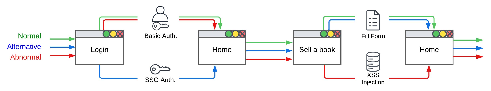

# Experiment 02

This folder contains the graphameleon-ds documents in relation to the *Navigation trace classification* experiment.

The following diagram provides an overview of navigation scenarios for the experiment:



From left to right, the key steps correspond to:

2) user authentication on the simulated online bookstore website, 
2) navigation to the homepage,
3) purchasing a book,
4) returning to the homepage.

The *authentication* step has two options: basic authentication or SSO authentication.
The *purchase* step alternates between normal input of the author's name in a form and input with XSS injection.

The arrows correspond to the sequence of steps for each scenario:

* **Base scenario (normal behavior)**: [basic authentication + fill form].  
  A user accesses the website, logs in to their account using their username and password, navigates to the "Sell a Book" page, fills out the form, and then returns to the homepage where they find their book.
* **Alternative scenario (different behavior)**: [SSO authentication + fill form].  
  A user accesses the website, logs in to their account using Single Sign-On (SSO), navigates to the "Sell a Book" page, fills out the form, and then returns to the homepage where they find their book.
* **XSS attack scenario (abnormal behavior)**: [basic authentication + XSS injection].  
  An attacker accesses the website, logs in to their account using their username and password, navigates to the "Sell a Book" page, and performs a code injection in the "Author" field. Finally, they return to the homepage where the injected script is executed.


## Workbench settings

Here is a summary of the settings for the experiment:

* Graphameleon 2.1.0
  - Collect mode: Micro
  - General output format: Semantize
  - Export format: Turtle syntax

* Firefox Browser 116.0.2 (64 bits) - Mozilla Firefox for Ubuntu

## Data capture and analysis

Data file names follow the naming convention:

```
# Canonical form
GPL_<NavigationScenarioName>.ttl

# Example
GPL_attack_scenario.ttl
```

The *NavigationScenarioName* field refers to the above-mentioned scenarios.

